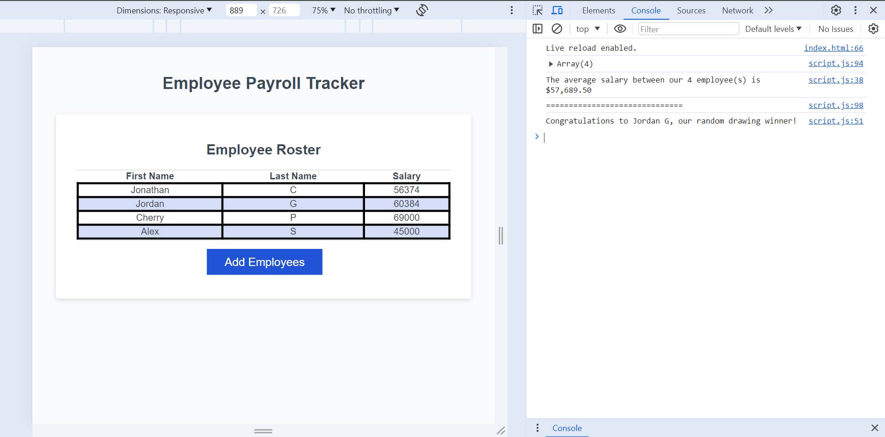

# Employee-Payroll

## Description

Recently, I developed an Employee Payroll Tracker. This application is designed to help the users in managing and monitoring the payroll details of employees through a newly designed interface.

- When users click the "Add Employees" button, they can enter employee details through a series of prompts that gather information such as the employee's first name, last name, and salary.

- This application allows users to add as many employees as needed or end the entry process whenever they choose.

- Once data entry is finished, the application sorts and displays the list of employees alphabetically by last name on the webpage, making it easier to access and manage specific entries.

- The console provides summarized information, including the average salary of employees, offering a brief overview of the organiztion's payroll costs.

## Usage

[Link to Deployed Website](https://jordangwiz.github.io/Employee-Payroll/)

## Collaborators

This project was made possible with the help of:

[Kaila Ronquillo](https://github.com/girlnotfound)

[Adam Rosenberg](https://github.com/AcoderRose)
